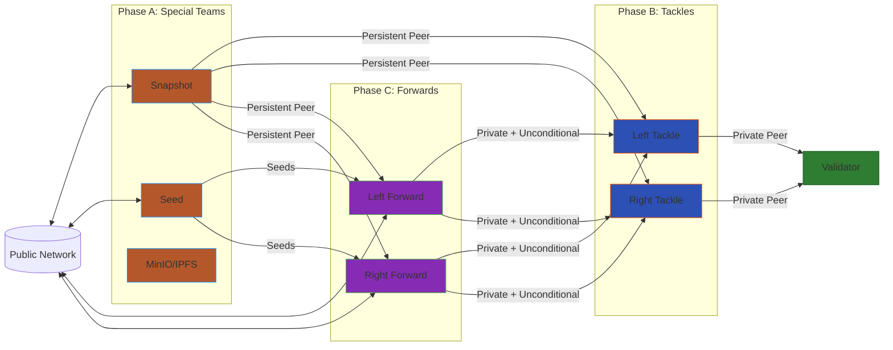

# O-Line

Automated deployment orchestrator for Terp Network sentry node arrays on [Akash Network](https://akash.network).

Deploys a full validator protection stack — snapshot node, seed node, MinIO snapshot storage, left/right tackle sentries, and left/right forward (public RPC/API/gRPC) nodes — all coordinated by a single `oline deploy` command.


## Topology



<!-- todo: topology for pfsense tunnel -->
<!-- todo: topology for head/tailscale -->

## Get Started

→ **[QUICKSTART.md](./QUICKSTART.md)** — install, configure, and deploy in one pass.

## Reference

| Doc | What it covers |
|-----|---------------|
| [QUICKSTART.md](./QUICKSTART.md) | Install, `.env` setup, `oline deploy`, SSH access |
| [docs/cli-reference.md](./docs/cli-reference.md) | All CLI commands with flags |
| [docs/testing.md](./docs/testing.md) | Test suite — categories, recipes, prerequisites |
| [docs/refresh.md](./docs/refresh.md) | Day-2 SSH-based node management |
| [docs/specialists.md](./docs/specialists.md) | Component specialist guide index |
| [docs/Oline.md](./docs/Oline.md) | Architecture and topology overview |

## Architecture

| Phase | Nodes | SDL | Purpose |
|-------|-------|-----|---------|
| A — Special Teams | snapshot, seed, minio | `templates/sdls/a/` | Bootstrap data, seed routing, snapshot storage |
| B — Tackles | left-tackle, right-tackle | `templates/sdls/b/` | Private sentries facing the validator |
| C — Forwards | left-forward, right-forward | `templates/sdls/c/` | Public RPC/API/gRPC endpoints |
| E — Relayer | relayer | `templates/sdls/e/` | IBC relaying (optional) |

The `oline` binary orchestrates deployment as a **step machine**: each step performs one unit of work, writes results to shared context, and advances to the next step. The step machine resumes from where it left off if interrupted.

## Deployment Strategies

**Parallel (default)** — all 7–8 providers rented simultaneously. HD-derived child accounts (BIP44 `m/44'/118'/0'/0/{index}`) avoid Cosmos sequence-number conflicts. Snapshot distribution fans out to all nodes concurrently via SSH stream relay.

**Sequential** — phases A → B → C → E, one at a time. Slower but uses a single Akash account.

```bash
oline deploy              # parallel (default)
oline deploy --sequential # sequential
```

## Development

```bash
cargo build                       # debug
cargo build --release             # release binary
just test all                     # unit + nginx + firewall + vpn (no Docker)
just test full                    # everything (Docker + Akash chain required)
```

See [docs/testing.md](./docs/testing.md) for the full test catalog and prerequisites.
