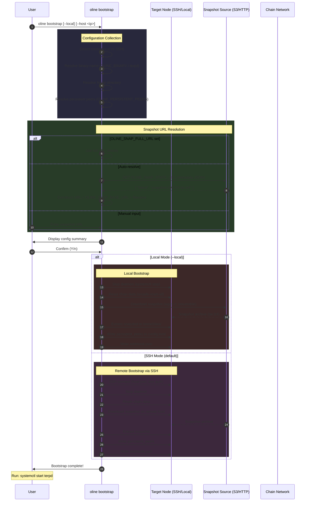
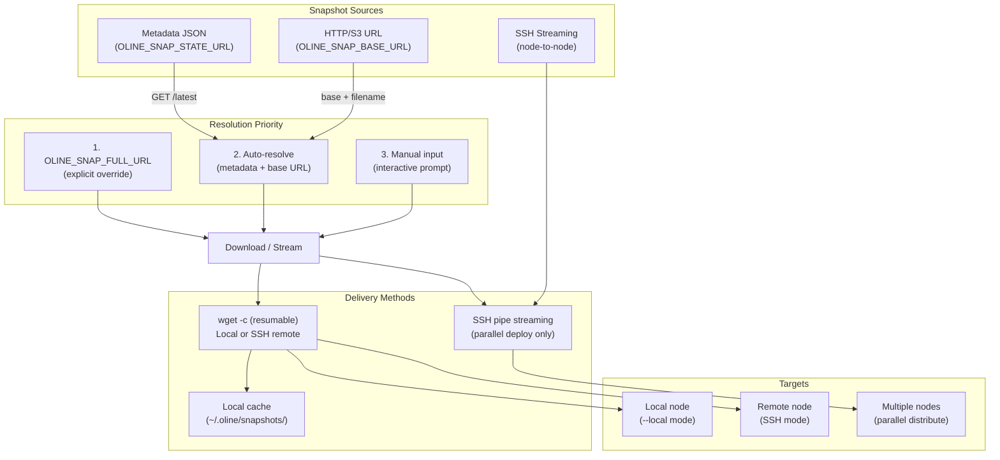

# Bootstrap Private Validator Node

Bootstraps a private validator node with peers and a chain snapshot, either locally or via SSH.

```mermaid
sequenceDiagram
    autonumber
    participant User
    participant CLI as oline bootstrap
    participant Target as Target Node (SSH/Local)
    participant S3 as Snapshot Source (S3/HTTP)
    participant Chain as Chain Network

    User->>CLI: oline bootstrap [--local] [--host <ip>]

    rect rgb(40, 40, 60)
        Note over CLI: Configuration Collection
        CLI->>CLI: Detect mode (local vs SSH)
        CLI->>CLI: Resolve binary name (OLINE_BINARY / terpd)
        CLI->>CLI: Resolve home directory
        CLI->>CLI: Resolve persistent peers (OLINE_PERSISTENT_PEERS)
    end

    rect rgb(40, 60, 40)
        Note over CLI,S3: Snapshot URL Resolution
        alt OLINE_SNAP_FULL_URL set
            CLI->>CLI: Use full URL directly
        else Auto-resolve
            CLI->>S3: GET OLINE_SNAP_STATE_URL (metadata JSON)
            S3-->>CLI: { "latest": "snapshot-XXXXX.tar.lz4" }
            CLI->>CLI: Construct URL = OLINE_SNAP_BASE_URL + filename
        else Manual input
            User->>CLI: Enter snapshot URL
        end
    end

    CLI->>User: Display config summary
    User->>CLI: Confirm (Y/n)

    alt Local Mode (--local)
        rect rgb(60, 40, 40)
            Note over CLI,Target: Local Bootstrap
            CLI->>Target: Stop daemon (systemctl stop)
            CLI->>Target: Reset chain data (unsafe-reset-all)
            CLI->>S3: Download snapshot (wget -c, resumable)
            S3-->>Target: Snapshot archive (tar.lz4)
            CLI->>Target: Extract snapshot to home/data/
            CLI->>Target: Write persistent_peers to config.toml
            CLI->>Target: Write addrbook.json
        end
    else SSH Mode (default)
        rect rgb(60, 40, 60)
            Note over CLI,Target: Remote Bootstrap via SSH
            CLI->>Target: SSH connect (host:port, key auth)
            CLI->>Target: Stop daemon
            CLI->>Target: Reset chain data
            CLI->>Target: Download snapshot on remote host
            S3-->>Target: Snapshot archive
            CLI->>Target: Extract snapshot
            CLI->>Target: Write persistent_peers
            CLI->>Target: Write addrbook.json
        end
    end

    CLI->>User: Bootstrap complete!
    Note over User: Run: systemctl start terpd
```

## Snapshot Distribution Methods

```mermaid
graph TD
    subgraph "Snapshot Sources"
        HTTP["HTTP/S3 URL<br/>(OLINE_SNAP_BASE_URL)"]
        META["Metadata JSON<br/>(OLINE_SNAP_STATE_URL)"]
        SFTP["SSH Streaming<br/>(node-to-node)"]
    end

    subgraph "Resolution Priority"
        P1["1. OLINE_SNAP_FULL_URL<br/>(explicit override)"]
        P2["2. Auto-resolve<br/>(metadata + base URL)"]
        P3["3. Manual input<br/>(interactive prompt)"]
    end

    META -->|"GET /latest"| P2
    HTTP -->|"base + filename"| P2
    P1 --> DL["Download / Stream"]
    P2 --> DL
    P3 --> DL

    subgraph "Delivery Methods"
        WGET["wget -c (resumable)<br/>Local or SSH remote"]
        PIPE["SSH pipe streaming<br/>(parallel deploy only)"]
        CACHE["Local cache<br/>(~/.oline/snapshots/)"]
    end

    DL --> WGET
    DL --> PIPE
    WGET --> CACHE
    SFTP --> PIPE

    subgraph "Targets"
        T_LOCAL["Local node<br/>(--local mode)"]
        T_SSH["Remote node<br/>(SSH mode)"]
        T_MULTI["Multiple nodes<br/>(parallel distribute)"]
    end

    WGET --> T_LOCAL
    WGET --> T_SSH
    PIPE --> T_MULTI
```
