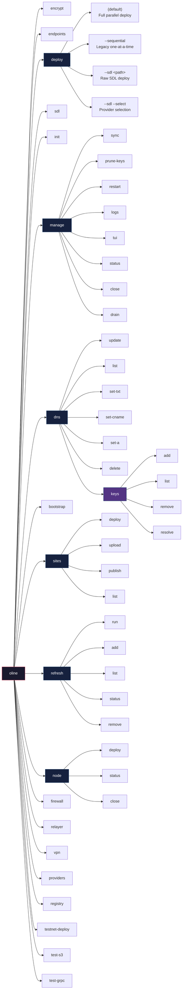

# O-Line CLI Command Tree

```mermaid
graph LR
    oline[oline] --> encrypt[encrypt]
    oline --> endpoints[endpoints]
    oline --> deploy[deploy]
    oline --> sdl[sdl]
    oline --> init[init]
    oline --> manage[manage]
    oline --> dns[dns]
    oline --> bootstrap[bootstrap]
    oline --> sites[sites]
    oline --> refresh[refresh]
    oline --> node[node]
    oline --> firewall[firewall]
    oline --> relayer[relayer]
    oline --> vpn[vpn]
    oline --> providers[providers]
    oline --> registry[registry]
    oline --> testnet[testnet-deploy]
    oline --> test_s3[test-s3]
    oline --> test_grpc[test-grpc]

    deploy --> deploy_full["(default)<br/>Full parallel deploy"]
    deploy --> deploy_seq["--sequential<br/>Legacy one-at-a-time"]
    deploy --> deploy_sdl["--sdl &lt;path&gt;<br/>Raw SDL deploy"]
    deploy --> deploy_select["--sdl --select<br/>Provider selection"]

    manage --> sync[sync]
    manage --> prune[prune-keys]
    manage --> restart[restart]
    manage --> logs[logs]
    manage --> tui[tui]
    manage --> status_m[status]
    manage --> close[close]
    manage --> drain[drain]

    dns --> update[update]
    dns --> list[list]
    dns --> set_txt[set-txt]
    dns --> set_cname[set-cname]
    dns --> set_a[set-a]
    dns --> delete[delete]
    dns --> keys[keys]

    keys --> keys_add[add]
    keys --> keys_list[list]
    keys --> keys_remove[remove]
    keys --> keys_resolve[resolve]

    sites --> sites_deploy[deploy]
    sites --> sites_upload[upload]
    sites --> sites_publish[publish]
    sites --> sites_list[list]

    refresh --> refresh_run[run]
    refresh --> refresh_add[add]
    refresh --> refresh_list[list]
    refresh --> refresh_status[status]
    refresh --> refresh_remove[remove]

    node --> node_deploy[deploy]
    node --> node_status[status]
    node --> node_close[close]

    style oline fill:#1a1a2e,stroke:#e94560,color:#fff
    style deploy fill:#16213e,stroke:#0f3460,color:#fff
    style manage fill:#16213e,stroke:#0f3460,color:#fff
    style dns fill:#16213e,stroke:#0f3460,color:#fff
    style sites fill:#16213e,stroke:#0f3460,color:#fff
    style refresh fill:#16213e,stroke:#0f3460,color:#fff
    style node fill:#16213e,stroke:#0f3460,color:#fff
    style keys fill:#533483,stroke:#0f3460,color:#fff
```
