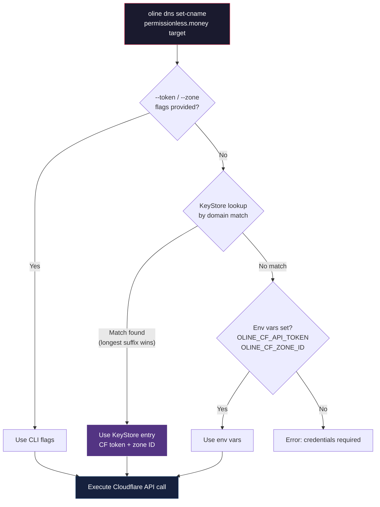
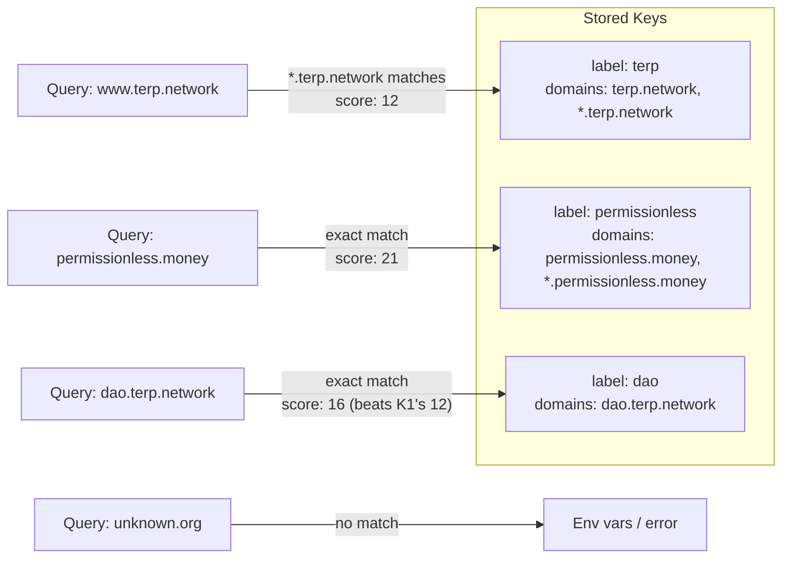
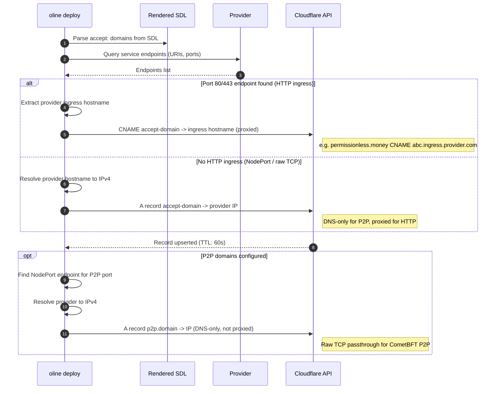

# DNS Management Workflow

## Credential Resolution

```mermaid
graph TD
    CMD["oline dns set-cname<br/>permissionless.money target"]

    CMD --> F1{"--token / --zone<br/>flags provided?"}
    F1 -->|Yes| USE_FLAGS["Use CLI flags"]
    F1 -->|No| F2{"KeyStore lookup<br/>by domain match"}

    F2 -->|"Match found<br/>(longest suffix wins)"| USE_KEYS["Use KeyStore entry<br/>CF token + zone ID"]
    F2 -->|No match| F3{"Env vars set?<br/>OLINE_CF_API_TOKEN<br/>OLINE_CF_ZONE_ID"}

    F3 -->|Yes| USE_ENV["Use env vars"]
    F3 -->|No| ERR["Error: credentials required"]

    USE_FLAGS --> EXEC["Execute Cloudflare API call"]
    USE_KEYS --> EXEC
    USE_ENV --> EXEC

    style CMD fill:#1a1a2e,stroke:#e94560,color:#fff
    style USE_KEYS fill:#533483,stroke:#fff,color:#fff
    style EXEC fill:#16213e,stroke:#0f3460,color:#fff
```

## KeyStore Domain Matching

```mermaid
graph LR
    subgraph "Stored Keys"
        K1["label: terp<br/>domains: terp.network, *.terp.network"]
        K2["label: permissionless<br/>domains: permissionless.money, *.permissionless.money"]
        K3["label: dao<br/>domains: dao.terp.network"]
    end

    Q1["Query: www.terp.network"] -->|"*.terp.network matches<br/>score: 12"| K1
    Q2["Query: permissionless.money"] -->|"exact match<br/>score: 21"| K2
    Q3["Query: dao.terp.network"] -->|"exact match<br/>score: 16 (beats K1's 12)"| K3
    Q4["Query: unknown.org"] -->|"no match"| FALLBACK["Env vars / error"]
```

## Post-Deploy DNS Update Flow

```mermaid
sequenceDiagram
    autonumber
    participant Deploy as oline deploy
    participant SDL as Rendered SDL
    participant Akash as Provider
    participant CF as Cloudflare API

    Deploy->>SDL: Parse accept: domains from SDL
    Deploy->>Akash: Query service endpoints (URIs, ports)
    Akash-->>Deploy: Endpoints list

    alt Port 80/443 endpoint found (HTTP ingress)
        Deploy->>Deploy: Extract provider ingress hostname
        Deploy->>CF: CNAME accept-domain -> ingress hostname (proxied)
        Note right of CF: e.g. permissionless.money CNAME abc.ingress.provider.com
    else No HTTP ingress (NodePort / raw TCP)
        Deploy->>Deploy: Resolve provider hostname to IPv4
        Deploy->>CF: A record accept-domain -> provider IP
        Note right of CF: DNS-only for P2P, proxied for HTTP
    end

    CF-->>Deploy: Record upserted (TTL: 60s)

    opt P2P domains configured
        Deploy->>Deploy: Find NodePort endpoint for P2P port
        Deploy->>Deploy: Resolve provider to IPv4
        Deploy->>CF: A record p2p.domain -> IP (DNS-only, not proxied)
        Note right of CF: Raw TCP passthrough for CometBFT P2P
    end
```
