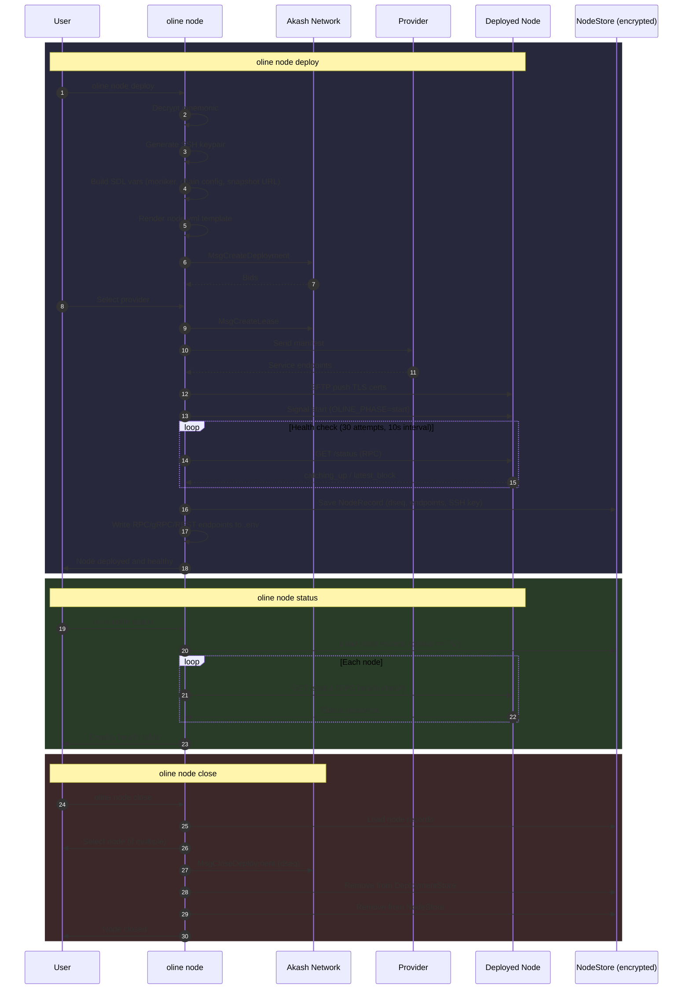
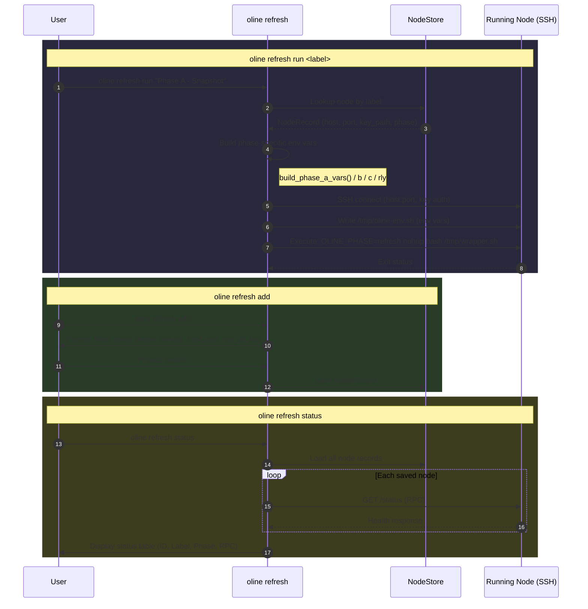
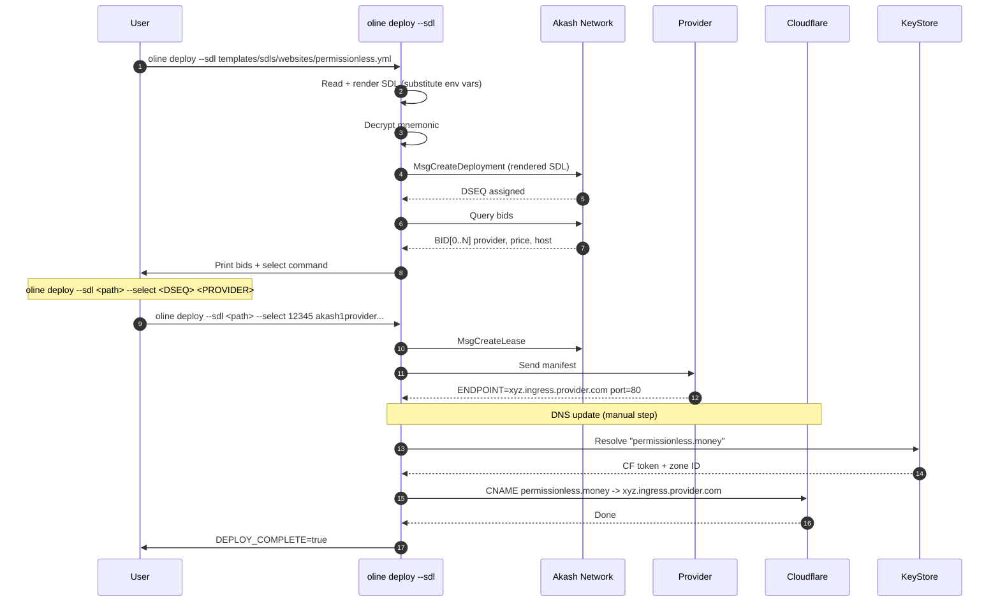

# Node Management Workflows

## Node Deploy & Lifecycle

```mermaid
sequenceDiagram
    autonumber
    participant User
    participant CLI as oline node
    participant Akash as Akash Network
    participant Provider as Provider
    participant Node as Deployed Node
    participant Store as NodeStore (encrypted)

    rect rgb(40, 40, 60)
        Note over User,Node: oline node deploy
        User->>CLI: oline node deploy
        CLI->>CLI: Decrypt mnemonic
        CLI->>CLI: Generate SSH keypair
        CLI->>CLI: Build SDL vars (moniker, chain config, snapshot URL)
        CLI->>CLI: Render node.yml template
        CLI->>Akash: MsgCreateDeployment
        Akash-->>CLI: Bids
        User->>CLI: Select provider
        CLI->>Akash: MsgCreateLease
        CLI->>Provider: Send manifest
        Provider-->>CLI: Service endpoints

        CLI->>Node: SFTP push TLS certs
        CLI->>Node: Signal start (OLINE_PHASE=start)

        loop Health check (30 attempts, 10s interval)
            CLI->>Node: GET /status (RPC)
            Node-->>CLI: catching_up / latest_block
        end

        CLI->>Store: Save NodeRecord (dseq, endpoints, SSH key)
        CLI->>CLI: Write RPC/gRPC/REST endpoints to .env
        CLI->>User: Node deployed and healthy
    end

    rect rgb(40, 60, 40)
        Note over User,Node: oline node status
        User->>CLI: oline node status
        CLI->>Store: Load node records (phase == "N")
        loop Each node
            CLI->>Node: GET /status (RPC health check)
            Node-->>CLI: Status response
        end
        CLI->>User: Display health table
    end

    rect rgb(60, 40, 40)
        Note over User,Akash: oline node close
        User->>CLI: oline node close
        CLI->>Store: Load node records
        CLI->>User: Select node (if multiple)
        CLI->>Akash: MsgCloseDeployment (dseq)
        CLI->>Store: Remove from DeploymentStore
        CLI->>Store: Remove from NodeStore
        CLI->>User: Node closed
    end
```

## Refresh - SSH Post-Deploy Management

```mermaid
sequenceDiagram
    autonumber
    participant User
    participant CLI as oline refresh
    participant Store as NodeStore
    participant Node as Running Node (SSH)

    rect rgb(40, 40, 60)
        Note over User,Node: oline refresh run <label>
        User->>CLI: oline refresh run "Phase A - Snapshot"
        CLI->>Store: Lookup node by label
        Store-->>CLI: NodeRecord (host, port, key_path, phase)
        CLI->>CLI: Build phase-specific env vars
        Note right of CLI: build_phase_a_vars() / b / c / rly
        CLI->>Node: SSH connect (host:port, key auth)
        CLI->>Node: Write /tmp/oline-env.sh (env vars)
        CLI->>Node: Execute: OLINE_PHASE=refresh nohup bash /tmp/wrapper.sh
        Node-->>CLI: Exit status
    end

    rect rgb(40, 60, 40)
        Note over User,Store: oline refresh add
        User->>CLI: oline refresh add
        CLI->>User: Prompt: label, dseq, phase, service, host, port, rpc_url, key
        User->>CLI: Provide details
        CLI->>Store: Save NodeRecord
    end

    rect rgb(60, 60, 30)
        Note over User,Node: oline refresh status
        User->>CLI: oline refresh status
        CLI->>Store: Load all node records
        loop Each saved node
            CLI->>Node: GET /status (RPC)
            Node-->>CLI: Health response
        end
        CLI->>User: Display status table (ID, Label, Phase, RPC)
    end
```

## Website Deploy (SDL flow)

```mermaid
sequenceDiagram
    autonumber
    participant User
    participant CLI as oline deploy --sdl
    participant Akash as Akash Network
    participant Provider as Provider
    participant CF as Cloudflare
    participant Keys as KeyStore

    User->>CLI: oline deploy --sdl templates/sdls/websites/permissionless.yml

    CLI->>CLI: Read + render SDL (substitute env vars)
    CLI->>CLI: Decrypt mnemonic
    CLI->>Akash: MsgCreateDeployment (rendered SDL)
    Akash-->>CLI: DSEQ assigned

    CLI->>Akash: Query bids
    Akash-->>CLI: BID[0..N] provider, price, host

    CLI->>User: Print bids + select command
    Note over User: oline deploy --sdl <path> --select <DSEQ> <PROVIDER>

    User->>CLI: oline deploy --sdl <path> --select 12345 akash1provider...
    CLI->>Akash: MsgCreateLease
    CLI->>Provider: Send manifest
    Provider-->>CLI: ENDPOINT=xyz.ingress.provider.com port=80

    Note over CLI,CF: DNS update (manual step)
    CLI->>Keys: Resolve "permissionless.money"
    Keys-->>CLI: CF token + zone ID
    CLI->>CF: CNAME permissionless.money -> xyz.ingress.provider.com
    CF-->>CLI: Done

    CLI->>User: DEPLOY_COMPLETE=true
```
