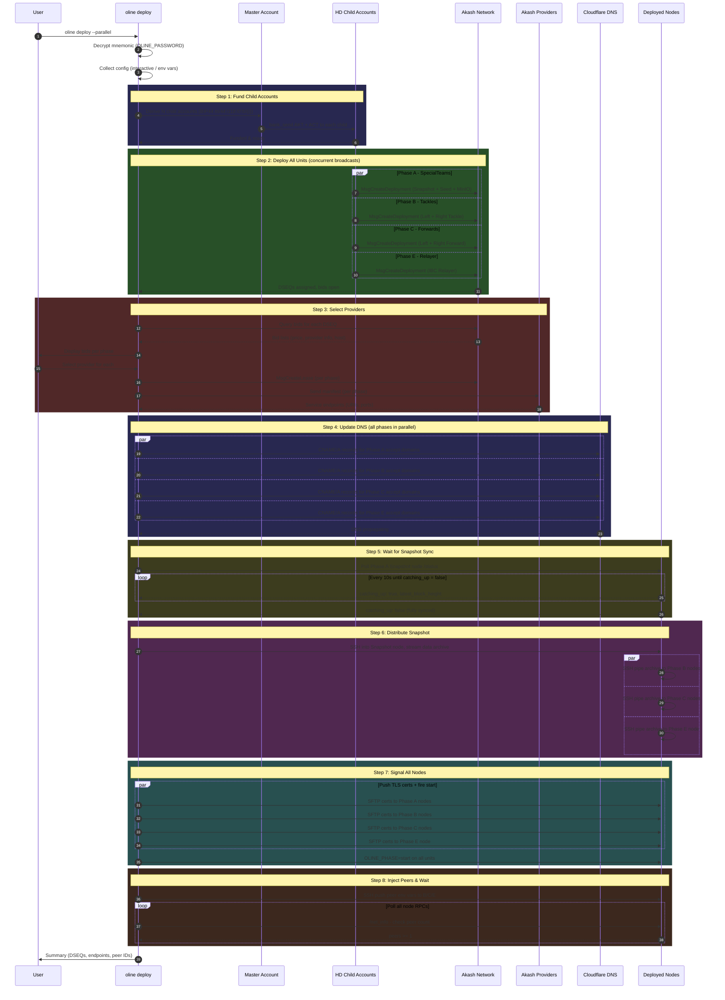

# Parallel Deployment Workflow

The default deployment strategy. All phases are deployed concurrently using HD-derived child accounts, then snapshot is distributed via SSH streaming.

```mermaid
sequenceDiagram
    autonumber
    participant User
    participant CLI as oline deploy
    participant Master as Master Account
    participant Children as HD Child Accounts
    participant Akash as Akash Network
    participant Providers as Akash Providers
    participant CF as Cloudflare DNS
    participant Nodes as Deployed Nodes

    User->>CLI: oline deploy --parallel
    CLI->>CLI: Decrypt mnemonic (OLINE_PASSWORD)
    CLI->>CLI: Collect config (interactive / env vars)

    rect rgb(40, 40, 80)
        Note over CLI,Children: Step 1: Fund Child Accounts
        CLI->>Master: Derive N child accounts (BIP44 m/44'/118'/0'/0/{i})
        Master->>Children: bank_send AKT + ACT to each child
        Children-->>CLI: Funded & ready
    end

    rect rgb(40, 80, 40)
        Note over CLI,Akash: Step 2: Deploy All Units (concurrent broadcasts)
        par Phase A - SpecialTeams
            Children->>Akash: MsgCreateDeployment (Snapshot + Seed + MinIO)
        and Phase B - Tackles
            Children->>Akash: MsgCreateDeployment (Left + Right Tackle)
        and Phase C - Forwards
            Children->>Akash: MsgCreateDeployment (Left + Right Forward)
        and Phase E - Relayer
            Children->>Akash: MsgCreateDeployment (IBC Relayer)
        end
        Akash-->>CLI: DSEQs assigned, bids open
    end

    rect rgb(80, 40, 40)
        Note over CLI,Providers: Step 3: Select Providers
        CLI->>Akash: Query bids for each DSEQ
        Akash-->>CLI: Bid lists (price, provider info, host)
        CLI->>User: Display bids per phase
        User->>CLI: Select provider for each
        CLI->>Akash: MsgCreateLease (per phase)
        CLI->>Providers: Send manifest (per phase)
        Providers-->>CLI: Service endpoints (URIs, ports)
    end

    rect rgb(40, 40, 80)
        Note over CLI,CF: Step 4: Update DNS (all phases in parallel)
        par
            CLI->>CF: CNAME/A records for Phase A accept domains
        and
            CLI->>CF: CNAME/A records for Phase B accept domains
        and
            CLI->>CF: CNAME/A records for Phase C accept domains
        and
            CLI->>CF: CNAME/A records for Phase E accept domains
        end
        CF-->>CLI: DNS propagating
    end

    rect rgb(60, 60, 30)
        Note over CLI,Nodes: Step 5: Wait for Snapshot Sync
        CLI->>Nodes: Poll Phase A Snapshot node /status
        loop Every 10s until catching_up = false
            Nodes-->>CLI: catching_up: true, latest_block_height
        end
        Nodes-->>CLI: catching_up: false (fully synced)
    end

    rect rgb(80, 40, 80)
        Note over CLI,Nodes: Step 6: Distribute Snapshot
        CLI->>Nodes: SSH into Snapshot node, stream data archive
        par
            Nodes->>Nodes: SSH pipe archive to Phase B nodes
        and
            Nodes->>Nodes: SSH pipe archive to Phase C nodes
        and
            Nodes->>Nodes: SSH pipe archive to Phase E node
        end
    end

    rect rgb(40, 80, 80)
        Note over CLI,Nodes: Step 7: Signal All Nodes
        par Push TLS certs + fire start
            CLI->>Nodes: SFTP certs to Phase A nodes
            CLI->>Nodes: SFTP certs to Phase B nodes
            CLI->>Nodes: SFTP certs to Phase C nodes
            CLI->>Nodes: SFTP certs to Phase E node
        end
        CLI->>Nodes: OLINE_PHASE=start on all units
    end

    rect rgb(60, 40, 30)
        Note over CLI,Nodes: Step 8: Inject Peers & Wait
        CLI->>Nodes: SSH push peer env vars to B/C/E
        loop Poll all node RPCs
            CLI->>Nodes: /net_info - check peer count
            Nodes-->>CLI: peers >= 1
        end
    end

    CLI->>User: Summary (DSEQs, endpoints, peer IDs)
```
