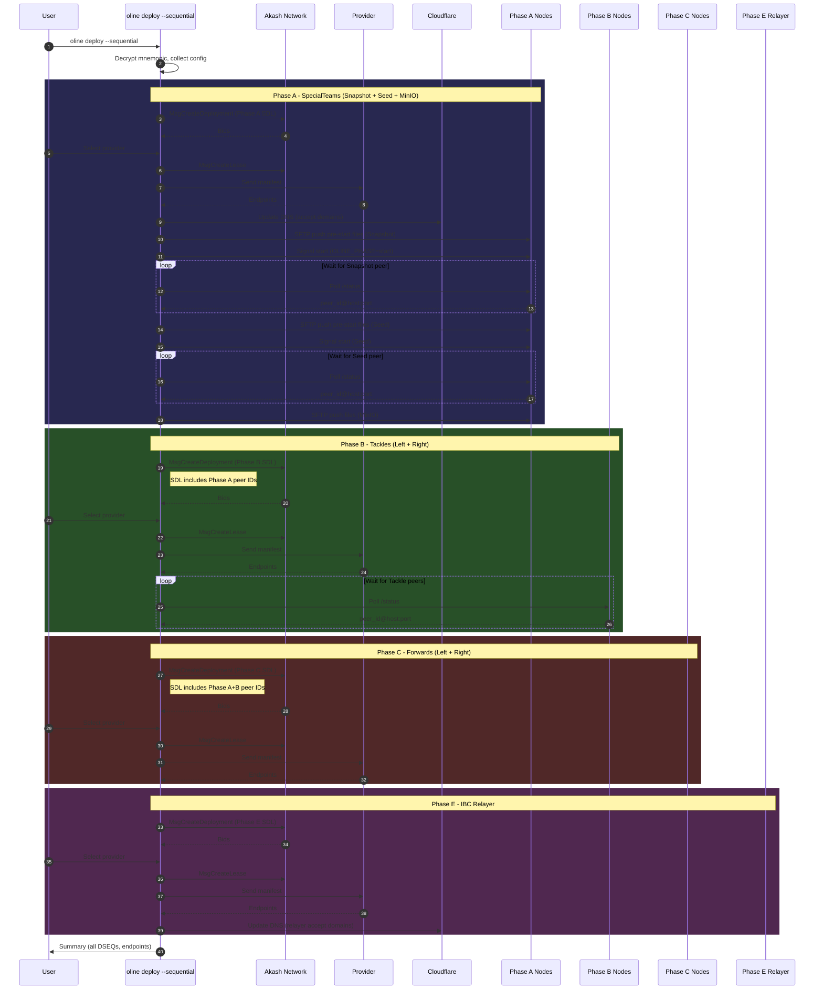

# Sequential Deployment Workflow (Legacy)

One phase at a time. Each phase completes before the next begins. Uses a single master account.

```mermaid
sequenceDiagram
    autonumber
    participant User
    participant CLI as oline deploy --sequential
    participant Akash as Akash Network
    participant Provider as Provider
    participant CF as Cloudflare
    participant NodeA as Phase A Nodes
    participant NodeB as Phase B Nodes
    participant NodeC as Phase C Nodes
    participant NodeE as Phase E Relayer

    User->>CLI: oline deploy --sequential
    CLI->>CLI: Decrypt mnemonic, collect config

    rect rgb(40, 40, 80)
        Note over CLI,NodeA: Phase A - SpecialTeams (Snapshot + Seed + MinIO)
        CLI->>Akash: MsgCreateDeployment (Phase A SDL)
        Akash-->>CLI: Bids
        User->>CLI: Select provider
        CLI->>Akash: MsgCreateLease
        CLI->>Provider: Send manifest
        Provider-->>CLI: Endpoints
        CLI->>CF: Update DNS (accept domains)

        CLI->>NodeA: SFTP push pre-start files (Snapshot)
        CLI->>NodeA: Signal start (OLINE_PHASE=start)
        loop Wait for Snapshot peer
            CLI->>NodeA: Poll /status
            NodeA-->>CLI: peer_id@host:port
        end

        CLI->>NodeA: SFTP push pre-start files (Seed)
        CLI->>NodeA: Signal start (Seed)
        loop Wait for Seed peer
            CLI->>NodeA: Poll /status
            NodeA-->>CLI: peer_id@host:port
        end

        CLI->>NodeA: SFTP push files (MinIO)
    end

    rect rgb(40, 80, 40)
        Note over CLI,NodeB: Phase B - Tackles (Left + Right)
        CLI->>Akash: MsgCreateDeployment (Phase B SDL)
        Note right of CLI: SDL includes Phase A peer IDs
        Akash-->>CLI: Bids
        User->>CLI: Select provider
        CLI->>Akash: MsgCreateLease
        CLI->>Provider: Send manifest
        Provider-->>CLI: Endpoints
        loop Wait for Tackle peers
            CLI->>NodeB: Poll /status
            NodeB-->>CLI: peer_id@host:port
        end
    end

    rect rgb(80, 40, 40)
        Note over CLI,NodeC: Phase C - Forwards (Left + Right)
        CLI->>Akash: MsgCreateDeployment (Phase C SDL)
        Note right of CLI: SDL includes Phase A+B peer IDs
        Akash-->>CLI: Bids
        User->>CLI: Select provider
        CLI->>Akash: MsgCreateLease
        CLI->>Provider: Send manifest
        Provider-->>CLI: Endpoints
    end

    rect rgb(80, 40, 80)
        Note over CLI,NodeE: Phase E - IBC Relayer
        CLI->>Akash: MsgCreateDeployment (Phase E SDL)
        Akash-->>CLI: Bids
        User->>CLI: Select provider
        CLI->>Akash: MsgCreateLease
        CLI->>Provider: Send manifest
        Provider-->>CLI: Endpoints
        CLI->>CF: Update DNS (relayer accept domains)
    end

    CLI->>User: Summary (all DSEQs, endpoints)
```
