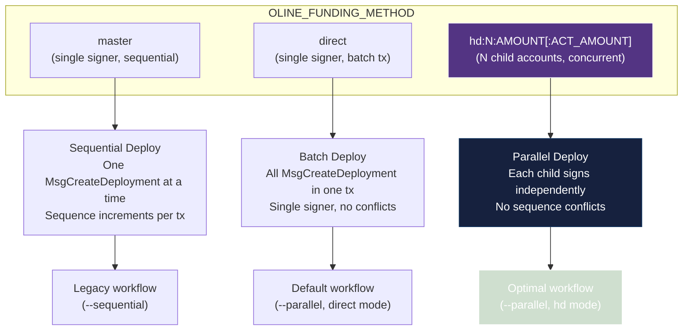
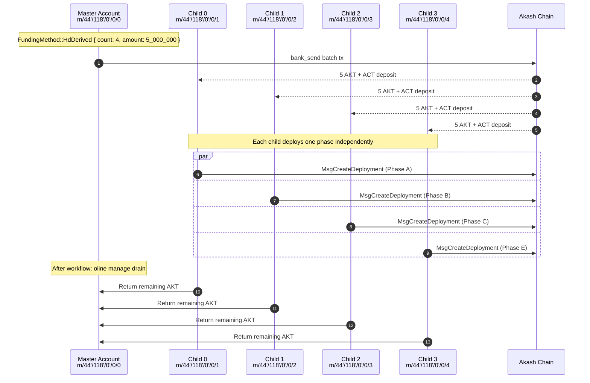
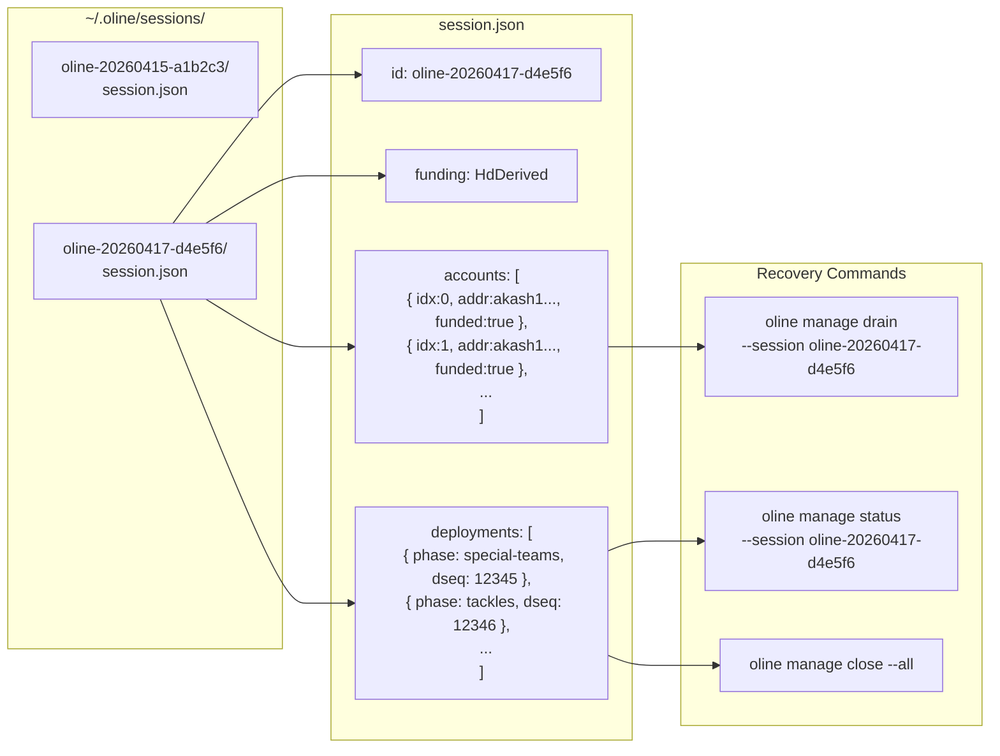

# Session & Account Lifecycle

## Funding Methods

```mermaid
graph TD
    subgraph "OLINE_FUNDING_METHOD"
        M["master<br/>(single signer, sequential)"]
        D["direct<br/>(single signer, batch tx)"]
        HD["hd:N:AMOUNT[:ACT_AMOUNT]<br/>(N child accounts, concurrent)"]
    end

    M --> SEQ["Sequential Deploy<br/>One MsgCreateDeployment at a time<br/>Sequence increments per tx"]
    D --> BATCH["Batch Deploy<br/>All MsgCreateDeployment in one tx<br/>Single signer, no conflicts"]
    HD --> PARALLEL["Parallel Deploy<br/>Each child signs independently<br/>No sequence conflicts"]

    SEQ --> LEGACY["Legacy workflow<br/>(--sequential)"]
    BATCH --> DEFAULT["Default workflow<br/>(--parallel, direct mode)"]
    PARALLEL --> OPTIMAL["Optimal workflow<br/>(--parallel, hd mode)"]

    style HD fill:#533483,stroke:#fff,color:#fff
    style PARALLEL fill:#16213e,stroke:#0f3460,color:#fff
    style OPTIMAL fill:#40804040,stroke:#fff,color:#fff
```

## HD Account Derivation & Funding

```mermaid
sequenceDiagram
    autonumber
    participant Master as Master Account<br/>m/44'/118'/0'/0/0
    participant Child0 as Child 0<br/>m/44'/118'/0'/0/1
    participant Child1 as Child 1<br/>m/44'/118'/0'/0/2
    participant Child2 as Child 2<br/>m/44'/118'/0'/0/3
    participant Child3 as Child 3<br/>m/44'/118'/0'/0/4
    participant Chain as Akash Chain

    Note over Master: FundingMethod::HdDerived { count: 4, amount: 5_000_000 }

    Master->>Chain: bank_send batch tx
    Chain-->>Child0: 5 AKT + ACT deposit
    Chain-->>Child1: 5 AKT + ACT deposit
    Chain-->>Child2: 5 AKT + ACT deposit
    Chain-->>Child3: 5 AKT + ACT deposit

    Note over Child0,Child3: Each child deploys one phase independently

    par
        Child0->>Chain: MsgCreateDeployment (Phase A)
    and
        Child1->>Chain: MsgCreateDeployment (Phase B)
    and
        Child2->>Chain: MsgCreateDeployment (Phase C)
    and
        Child3->>Chain: MsgCreateDeployment (Phase E)
    end

    Note over Master: After workflow: oline manage drain
    Child0->>Master: Return remaining AKT
    Child1->>Master: Return remaining AKT
    Child2->>Master: Return remaining AKT
    Child3->>Master: Return remaining AKT
```

## Session Persistence

```mermaid
graph LR
    subgraph "~/.oline/sessions/"
        S1["oline-20260415-a1b2c3/<br/>session.json"]
        S2["oline-20260417-d4e5f6/<br/>session.json"]
    end

    subgraph "session.json"
        ID["id: oline-20260417-d4e5f6"]
        FUND["funding: HdDerived"]
        ACCTS["accounts: [<br/>  { idx:0, addr:akash1..., funded:true },<br/>  { idx:1, addr:akash1..., funded:true },<br/>  ...<br/>]"]
        DEPS["deployments: [<br/>  { phase: special-teams, dseq: 12345 },<br/>  { phase: tackles, dseq: 12346 },<br/>  ...<br/>]"]
    end

    S2 --> ID
    S2 --> FUND
    S2 --> ACCTS
    S2 --> DEPS

    subgraph "Recovery Commands"
        MNG_STATUS["oline manage status<br/>--session oline-20260417-d4e5f6"]
        MNG_DRAIN["oline manage drain<br/>--session oline-20260417-d4e5f6"]
        MNG_CLOSE["oline manage close --all"]
    end

    DEPS --> MNG_STATUS
    ACCTS --> MNG_DRAIN
    DEPS --> MNG_CLOSE
```
