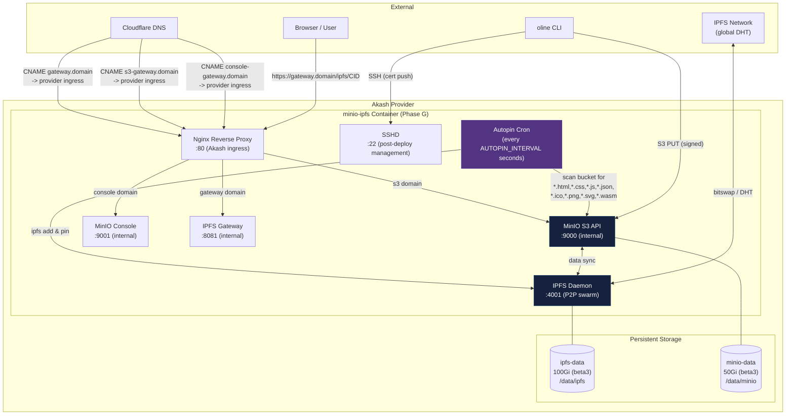
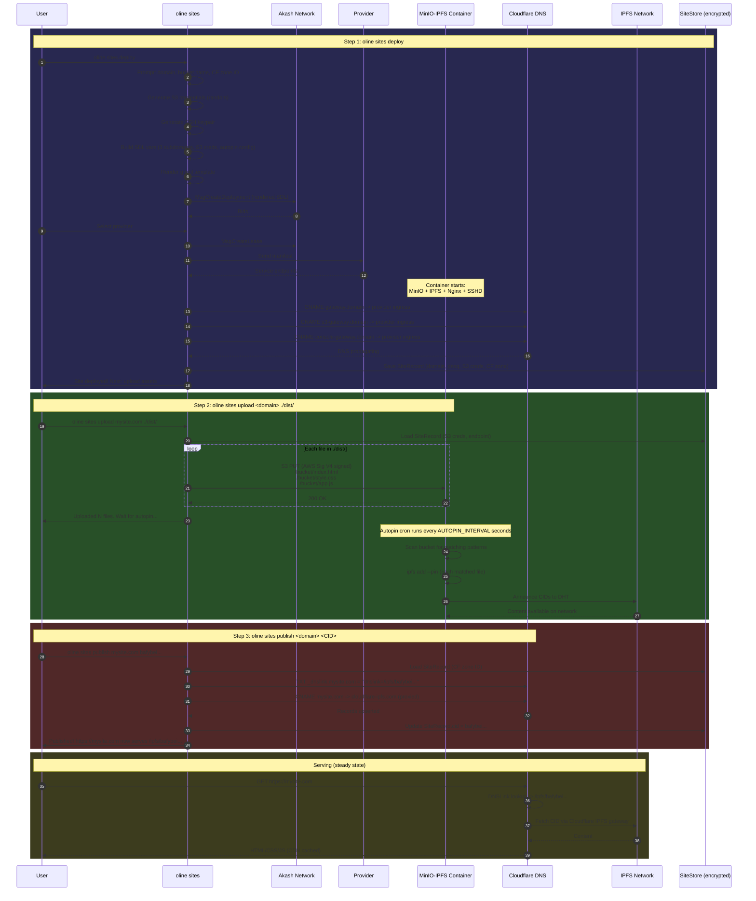
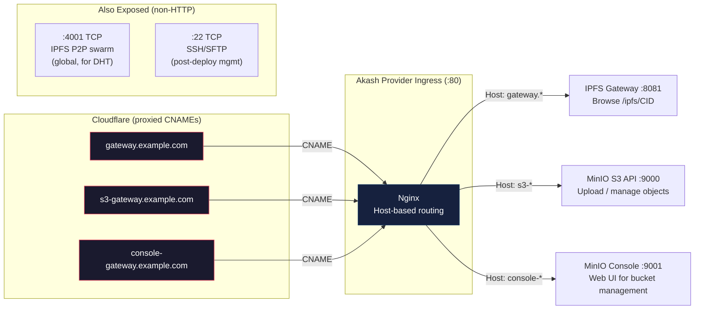
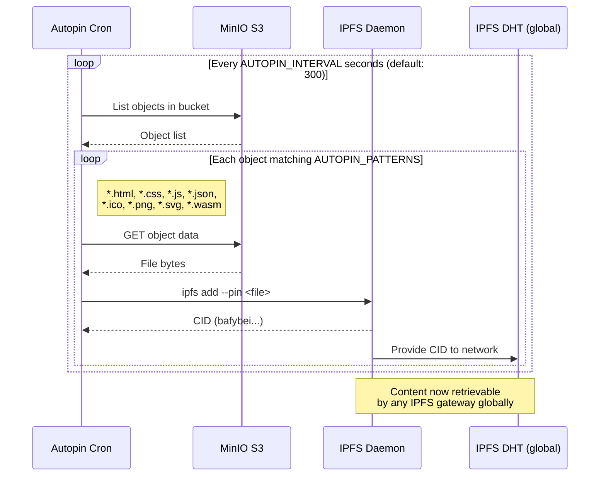
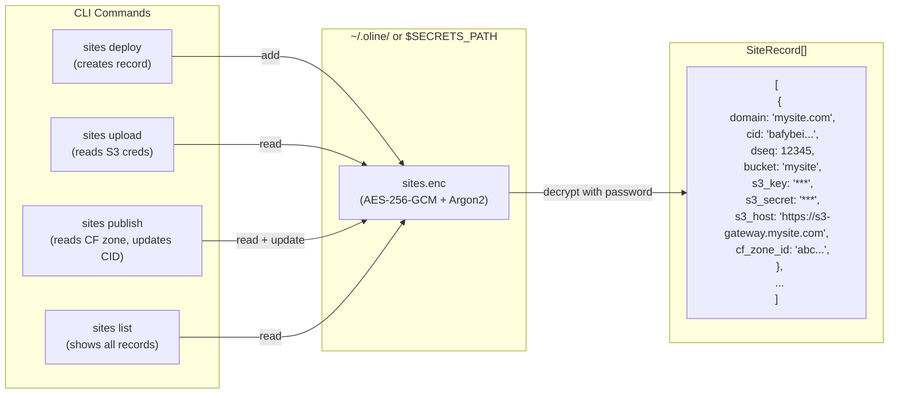

# MinIO-IPFS Static Website Hosting

## Container Architecture

```mermaid
graph TB
    subgraph "Akash Provider"
        subgraph "minio-ipfs Container (Phase G)"
            NGINX["Nginx Reverse Proxy<br/>:80 (Akash ingress)"]
            MINIO_S3["MinIO S3 API<br/>:9000 (internal)"]
            MINIO_CONSOLE["MinIO Console<br/>:9001 (internal)"]
            IPFS_GW["IPFS Gateway<br/>:8081 (internal)"]
            IPFS_NODE["IPFS Daemon<br/>:4001 (P2P swarm)"]
            SSHD["SSHD<br/>:22 (post-deploy management)"]
            AUTOPIN["Autopin Cron<br/>(every AUTOPIN_INTERVAL seconds)"]

            NGINX -->|"gateway domain"| IPFS_GW
            NGINX -->|"s3 domain"| MINIO_S3
            NGINX -->|"console domain"| MINIO_CONSOLE

            AUTOPIN -->|"scan bucket for<br/>*.html,*.css,*.js,*.json,<br/>*.ico,*.png,*.svg,*.wasm"| MINIO_S3
            AUTOPIN -->|"ipfs add & pin"| IPFS_NODE

            MINIO_S3 <-->|"data sync"| IPFS_NODE
        end

        subgraph "Persistent Storage"
            IPFS_DATA[("ipfs-data<br/>100Gi (beta3)<br/>/data/ipfs")]
            MINIO_DATA[("minio-data<br/>50Gi (beta3)<br/>/data/minio")]
        end

        IPFS_NODE --- IPFS_DATA
        MINIO_S3 --- MINIO_DATA
    end

    subgraph "External"
        CF["Cloudflare DNS"]
        BROWSER["Browser / User"]
        IPFS_NET["IPFS Network<br/>(global DHT)"]
        CLI["oline CLI"]
    end

    CF -->|"CNAME gateway.domain<br/>-> provider ingress"| NGINX
    CF -->|"CNAME s3-gateway.domain<br/>-> provider ingress"| NGINX
    CF -->|"CNAME console-gateway.domain<br/>-> provider ingress"| NGINX
    BROWSER -->|"https://gateway.domain/ipfs/CID"| NGINX
    IPFS_NET <-->|"bitswap / DHT"| IPFS_NODE
    CLI -->|"S3 PUT (signed)"| MINIO_S3
    CLI -->|"SSH (cert push)"| SSHD

    style AUTOPIN fill:#533483,stroke:#fff,color:#fff
    style IPFS_NODE fill:#16213e,stroke:#0f3460,color:#fff
    style MINIO_S3 fill:#16213e,stroke:#0f3460,color:#fff
```

## Full Site Lifecycle

```mermaid
sequenceDiagram
    autonumber
    participant User
    participant CLI as oline sites
    participant Akash as Akash Network
    participant Provider as Provider
    participant Container as MinIO-IPFS Container
    participant CF as Cloudflare DNS
    participant IPFS as IPFS Network
    participant Store as SiteStore (encrypted)

    rect rgb(40, 40, 80)
        Note over User,Store: Step 1: oline sites deploy
        User->>CLI: oline sites deploy
        CLI->>CLI: Prompt: domain, bucket name, CF zone ID
        CLI->>CLI: Generate S3 credentials (random)
        CLI->>CLI: Generate SSH keypair
        CLI->>CLI: Build SDL vars (3 subdomains, S3 creds, autopin config)
        CLI->>CLI: Render g.yml template

        CLI->>Akash: MsgCreateDeployment (rendered SDL)
        Akash-->>CLI: Bids
        User->>CLI: Select provider
        CLI->>Akash: MsgCreateLease
        CLI->>Provider: Send manifest
        Provider-->>CLI: Service endpoints

        Note over Container: Container starts:<br/>MinIO + IPFS + Nginx + SSHD

        CLI->>CF: CNAME gateway.domain -> provider ingress
        CLI->>CF: CNAME s3-gateway.domain -> provider ingress
        CLI->>CF: CNAME console-gateway.domain -> provider ingress
        CF-->>CLI: DNS propagating

        CLI->>Store: Save SiteRecord (domain, dseq, S3 creds, CF zone)
        CLI->>User: Site deployed! Next: upload assets
    end

    rect rgb(40, 80, 40)
        Note over User,Container: Step 2: oline sites upload <domain> ./dist/
        User->>CLI: oline sites upload mysite.com ./dist/
        CLI->>Store: Load SiteRecord (S3 creds, endpoint)

        loop Each file in ./dist/
            CLI->>Container: S3 PUT (AWS Sig V4 signed)<br/>/bucket/index.html<br/>/bucket/style.css<br/>/bucket/app.js
            Container-->>CLI: 200 OK
        end

        CLI->>User: Uploaded N files. Wait for autopin...

        Note over Container: Autopin cron runs every AUTOPIN_INTERVAL seconds
        Container->>Container: Scan bucket for matching patterns
        Container->>Container: ipfs add --pin (each matched file)
        Container->>IPFS: Announce CIDs to DHT
        IPFS-->>Container: Content available on network
    end

    rect rgb(80, 40, 40)
        Note over User,CF: Step 3: oline sites publish <domain> <CID>
        User->>CLI: oline sites publish mysite.com bafybei...
        CLI->>Store: Load SiteRecord (CF zone ID)

        CLI->>CF: TXT _dnslink.mysite.com = "dnslink=/ipfs/bafybei..."
        CLI->>CF: CNAME mysite.com -> cloudflare-ipfs.com (proxied)
        CF-->>CLI: Records upserted

        CLI->>Store: Update SiteRecord.cid = bafybei...
        CLI->>User: Published! https://mysite.com now serves /ipfs/bafybei...
    end

    rect rgb(60, 60, 30)
        Note over User,IPFS: Serving (steady state)
        User->>CF: GET https://mysite.com
        CF->>CF: DNSLink lookup -> /ipfs/bafybei...
        CF->>IPFS: Fetch CID via Cloudflare IPFS gateway
        IPFS-->>CF: Content
        CF-->>User: HTML/CSS/JS (CDN cached)
    end
```

## Three Domain Routing

```mermaid
graph LR
    subgraph "Cloudflare (proxied CNAMEs)"
        GW["gateway.example.com"]
        S3["s3-gateway.example.com"]
        CON["console-gateway.example.com"]
    end

    subgraph "Akash Provider Ingress (:80)"
        NGINX["Nginx<br/>Host-based routing"]
    end

    GW -->|CNAME| NGINX
    S3 -->|CNAME| NGINX
    CON -->|CNAME| NGINX

    NGINX -->|"Host: gateway.*"| IPFS_GW["IPFS Gateway :8081<br/>Browse /ipfs/CID"]
    NGINX -->|"Host: s3-*"| MINIO_API["MinIO S3 API :9000<br/>Upload / manage objects"]
    NGINX -->|"Host: console-*"| MINIO_WEB["MinIO Console :9001<br/>Web UI for bucket management"]

    subgraph "Also Exposed (non-HTTP)"
        P2P[":4001 TCP<br/>IPFS P2P swarm<br/>(global, for DHT)"]
        SSH[":22 TCP<br/>SSH/SFTP<br/>(post-deploy mgmt)"]
    end

    style GW fill:#1a1a2e,stroke:#e94560,color:#fff
    style S3 fill:#1a1a2e,stroke:#e94560,color:#fff
    style CON fill:#1a1a2e,stroke:#e94560,color:#fff
    style NGINX fill:#16213e,stroke:#0f3460,color:#fff
```

## Autopin Mechanism

```mermaid
sequenceDiagram
    participant Cron as Autopin Cron
    participant MinIO as MinIO S3
    participant IPFS as IPFS Daemon
    participant DHT as IPFS DHT (global)

    loop Every AUTOPIN_INTERVAL seconds (default: 300)
        Cron->>MinIO: List objects in bucket
        MinIO-->>Cron: Object list

        loop Each object matching AUTOPIN_PATTERNS
            Note right of Cron: *.html, *.css, *.js, *.json,<br/>*.ico, *.png, *.svg, *.wasm
            Cron->>MinIO: GET object data
            MinIO-->>Cron: File bytes
            Cron->>IPFS: ipfs add --pin <file>
            IPFS-->>Cron: CID (bafybei...)
            IPFS->>DHT: Provide CID to network
        end
    end

    Note over IPFS,DHT: Content now retrievable<br/>by any IPFS gateway globally
```

## SiteStore Encrypted Persistence

```mermaid
graph LR
    subgraph "~/.oline/ or $SECRETS_PATH"
        ENC["sites.enc<br/>(AES-256-GCM + Argon2)"]
    end

    ENC -->|"decrypt with password"| RECORDS

    subgraph "SiteRecord[]"
        RECORDS["[<br/>  {<br/>    domain: 'mysite.com',<br/>    cid: 'bafybei...',<br/>    dseq: 12345,<br/>    bucket: 'mysite',<br/>    s3_key: '***',<br/>    s3_secret: '***',<br/>    s3_host: 'https://s3-gateway.mysite.com',<br/>    cf_zone_id: 'abc...',<br/>  },<br/>  ...<br/>]"]
    end

    subgraph "CLI Commands"
        DEP["sites deploy<br/>(creates record)"]
        UPL["sites upload<br/>(reads S3 creds)"]
        PUB["sites publish<br/>(reads CF zone, updates CID)"]
        LST["sites list<br/>(shows all records)"]
    end

    DEP -->|add| ENC
    UPL -->|read| ENC
    PUB -->|read + update| ENC
    LST -->|read| ENC
```
