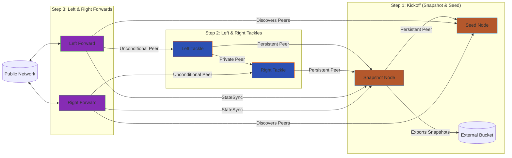

# Akash Deployment Script for Terp Network O-Line

This README describes the Bash scripting library (`a.deploy-oline.sh`) for deploying Terp Network nodes on the Akash Network. The script automates the setup of a structured node deployment following an "O-Line" analogy, deploying snapshot, seed, tackle, and forward nodes in sequence. It handles key setup, certificate management, provider selection from trusted lists, and sequential deployments using SDL (Service Definition Language) files.

## Overview

The script (`a.deploy-oline.sh`) is designed to deploy a set of Terp Network nodes on Akash in a phased manner:
- **Step 1: Kickoff (Snapshot and Seed Nodes)**: Deploys a snapshot node for state synchronization and a seed node for peer discovery.
- **Step 2: Tackles (Left and Right Sentry Nodes)**: Deploys sentry nodes that connect privately to the snapshot and each other.
- **Step 3: Forwards (Left and Right Public Nodes)**: Deploys public-facing nodes that use the previous nodes for synchronization and peering.

Key features:
- Uses trusted Akash providers for deployments.
- Automates bid selection based on lowest price from trusted providers.
- Updates SDL files dynamically with node peer IDs.
- Checks for existing deployments and allows closure.
- Installs dependencies like `provider-services` if needed.

The script relies on predefined SDL files in `sdls/` and logs progress.

## Prerequisites

- **Akash CLI**: Ensure `provider-services` is installed (script can auto-install on macOS/Linux).
- **Dependencies**: `jq` for JSON parsing, `yq` for YAML modifications (warns if missing).
- **Akash Account**: Funded with uAKT (script checks balance).
- **Environment**: macOS or Linux (script detects OS for installation).
- **Trusted Providers**: Predefined list in the script; modify `TRUSTED_PROVIDERS` array as needed.

## Usage

1. **Set Environment Variables** (optional, defaults are set):
   - `AKASH_KEY_NAME`: Key name (default: `test1`).
   - `AKASH_NODE`: RPC node (default: `https://rpc-akash.ecostake.com:443`).
   - `AKASH_CHAIN_ID`: Chain ID (fetched from network).
   - Customize gas fees, providers, etc., in the script.

2. **Run the Script**:
   ```bash
   bash a.deploy-oline.sh
   ```

3. **Process**:
   - Checks dependencies and installs if needed.
   - Sets up keys and certificates.
   - Checks/closes existing deployments (interactive).
   - Deploys in sequence: Kickoff → Tackles → Forwards.
   - Saves deployment info to `deployment_uris.env`.

4. **Example Output**:
   The script logs info, warnings, and errors in color-coded format.

## Deployment Flow

The deployment follows a football "O-Line" structure for node protection and efficiency.



## Script Structure

- **Variables**: Defines services, logs, SDL files, trusted providers.
- **Functions**:
  - `install_provider_services`: Installs Akash provider tools.
  - `check_dependencies`: Verifies tools like `jq`, `yq`.
  - `setup_keys`: Manages Akash keys and checks balance.
  - `setup_certificate`: Creates/publishes client certificate.
  - `check_existing_deployments`: Lists and optionally closes active deployments.
  - `wait_for_bids`: Polls for bids on a deployment.
  - `deploy_sdl`: Deploys an SDL file, selects provider, creates lease, sends manifest.
  - `get_node_peer_id`: Retrieves node ID via RPC.
  - `update_sdl_with_node_info`: Updates SDL env vars with peer IDs.
  - `main`: Orchestrates the full deployment.

## Troubleshooting and Known Issues

- **No Bids Received**: If no bids after 12 attempts, check trusted providers list or network status. Increase `max_attempts` or adjust `wait_time`.
- **Lease Not Active**: Verify gas fees and account balance. Retry with higher gas adjustment.
- **Dependency Installation Fails**: On Linux, ensure Go >=1.21 is installed. On macOS, Homebrew must be available.
- **YAML Modification Errors**: Install `yq` for dynamic SDL updates.
- **RPC Connection Issues**: Ensure the `AKASH_NODE` URL is valid and accessible.
- **Provider Selection**: If no trusted providers bid, expand `TRUSTED_PROVIDERS` or handle manually.
- **Snapshot Time**: Script sets snapshot time 10 mins ahead; adjust if needed.

For errors, check logs in defined `LOG_FILES` or script output.

## TODO: System Improvements

To make the system more generic and modular:

- [ ] Refactor into Rust for better performance, error handling, and cross-platform support.
- [ ] Define Protocol Buffers (protobuf) schemas for key values (e.g., peer IDs, deployment info) to enable interoperability with Rust, Go, and Python crates.
- [ ] Create modular crates/libraries in Rust/Go/Python for reusable components (e.g., provider selection, SDL updates).
- [ ] Add support for other chains beyond Terp Network (generic chain config loading).
- [ ] Implement automated Cloudflare DNS updates (uncomment and complete the function).
- [ ] Add unit tests for functions like bid selection and peer ID retrieval.
- [ ] Support for multiple deployment environments (testnet/mainnet).

Contributions welcome!
