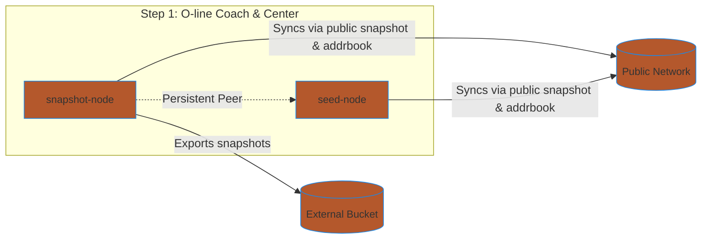
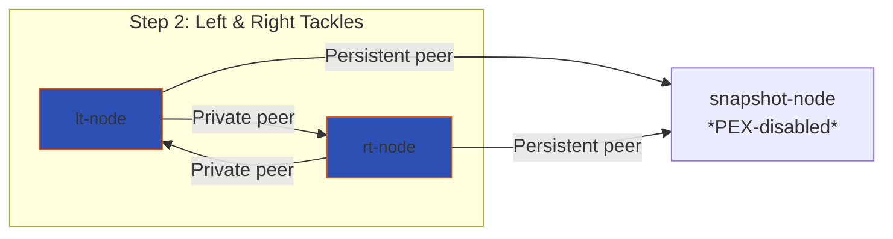
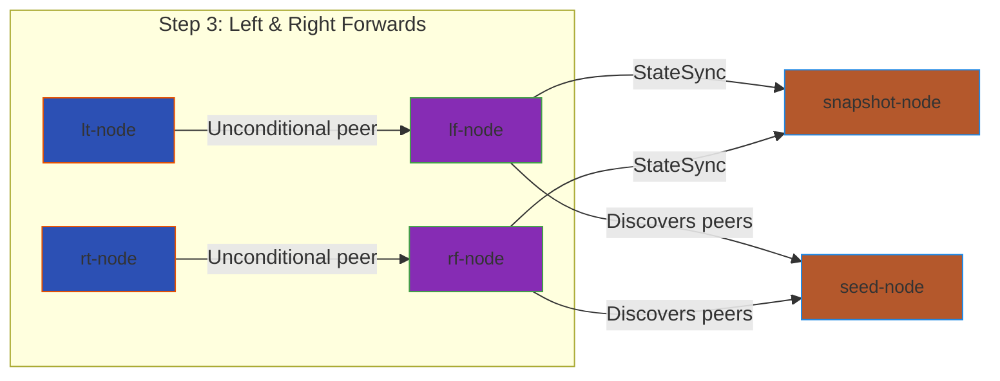

# TERP O-Line - Run Terp Network Nodes on Akash

Make deploying Terp Network nodes onto [Akash](//github.com/akash-network/node)
easy and standardized.

## Step 1: O-line coach & center

- 1 snapshot node + 1 seed node
- snapshot: syncs to untrusted peers via public snapshot & addrbook
- snapshot: maintains/creates snapshots for public to use
- snapshot: export snapshots to external buckets once created
- snapshot: PEX disabled
- snapshot: statesync enabled
- snapshot: set private peers as local nodes (becomes centry node)
- seed: sync to network via public snapshot & addrbook
- seed: PEX enabled
- seed: statesync enabled
- seed: swag enabled
- seed: prune everything

## Step 2: Left & Right tackles

- lt: syncs to network via snapshot node
- lt: default pruning strategy
- lt: statesync enabled
- lt: PEX disabled
- lt: set private peers as local nodes (becomes centry node)
- lt: snaspshot-node is persistent peer
- rt: same configuration as lt

## Step 3: Left & Right Forwards

- lf: sync to network via our seed & snapshots
- lf: statesync enabled
- lf: use public addrbook
- lf: PEX enabled
- lf: left & right tackles are private & unconditional peers
- lf: snapshot node is persistent peer
- syncs to latest height via public (untrusted) snapshots/peers
- rf: identical to left foraward
