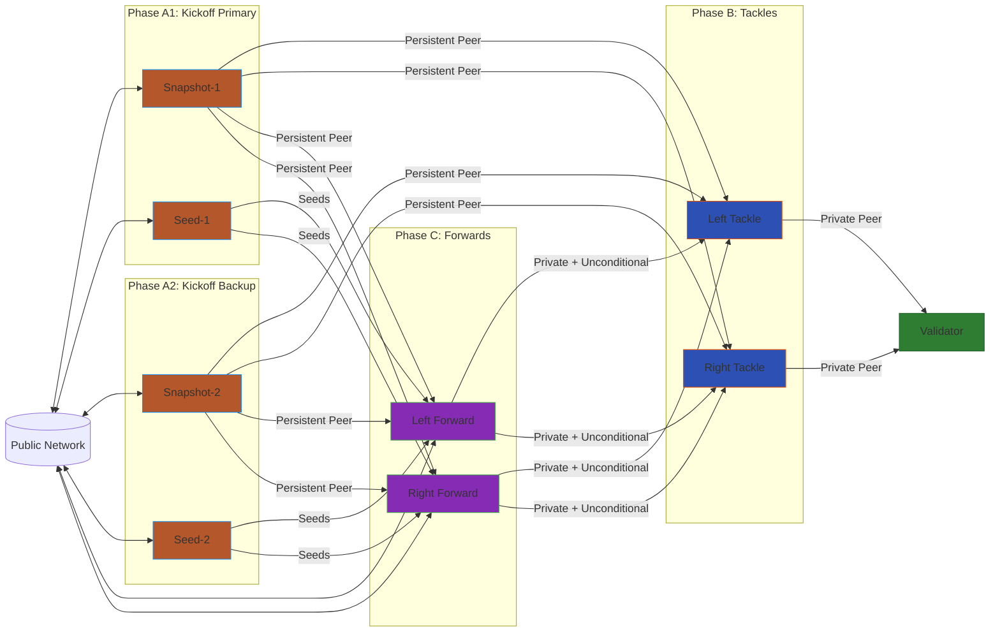

# O-Line SDL Deployer

A Rust CLI for deploying Terp Network's "O-Line" node infrastructure on Akash Network. It automates the 4-phase deployment of snapshot, seed, sentry, and public nodes with encrypted mnemonic storage and redundant infrastructure.

## What It Does

The deployer runs four sequential phases, each deploying a pair of nodes that connect to the previous phase:

1. **Kickoff A1** — Snapshot-1 + Seed-1
2. **Kickoff A2** — Snapshot-2 + Seed-2 (separate provider for redundancy)
3. **Tackles** — Left & Right sentries, peered to both snapshots + both seeds
4. **Forwards** — Left & Right public nodes, cross-braced to both tackles

Each phase automatically extracts peer IDs from the deployed nodes and feeds them into the next phase's SDL configuration.

## Prerequisites

- **Rust toolchain** — `rustup` with stable Rust
- **Funded Akash account** — mnemonic for an account with uAKT balance
- **Snapshot URL** — URL of a Terp Network chain snapshot
- **Validator peer ID** — your validator's `node_id@host:port`

## Build & Install

```bash
just install
```

This builds and installs the `oline` binary to `~/.cargo/bin/`. Make sure `~/.cargo/bin` is in your `PATH`.

## First-Time Setup: Encrypt Your Mnemonic

Before deploying, encrypt your mnemonic so it's stored safely in a `.env` file rather than entered as plaintext each time.

```bash
oline encrypt
```

You'll be prompted for:

1. **Mnemonic** — your Akash account mnemonic (input is hidden)
2. **Password** — encryption password (input is hidden)
3. **Confirm password** — must match

This writes `OLINE_ENCRYPTED_MNEMONIC=<base64>` to a `.env` file in the current directory. The mnemonic is encrypted with AES-256-GCM using an Argon2id-derived key.

## Deploy

```bash
oline deploy
```

Or simply (deploy is the default):

```bash
oline
```

The tool will:

1. Prompt for your **password** (hidden) to decrypt the mnemonic from `.env`
2. Ask for **RPC endpoint** (defaults to `https://rpc.akashnet.net:443`)
3. Ask for **snapshot URL**
4. Ask for **validator peer ID**
5. Ask for **trusted provider addresses** (optional)
6. Ask whether to **auto-select cheapest provider** or manually choose
7. Walk through each deployment phase interactively, confirming before each SDL deploy

### Manual Provider Selection

To manually choose providers for each phase:

1. When prompted "Auto-select cheapest provider?", answer `n`
2. For each deployment phase, you'll see a table of available bids:

```
Available Providers:
----------------------------------------------------------------------------------------------------
No.  Name                           Price (AKT) Website                        Region
----------------------------------------------------------------------------------------------------
1    provider.akashnet.com               1.234567 https://provider.akashnet.com  us-west
2    cloudmos.io                         0.987654 https://cloudmos.io            eu-central
3    akash1abc..def4                     1.567890 -                              -
----------------------------------------------------------------------------------------------------
Select provider (1-3) or 'a' to auto-select cheapest:
```

Provider details (name, website, region) are queried from Akash Network using `query_provider_info`.

1. Enter the number (1-3) or `a` to auto-select the cheapest bid

## Advanced: Raw Mode

For one-off deployments without a `.env` file:

```bash
oline deploy --raw
```

This prompts for the mnemonic directly (input is hidden) instead of reading from `.env`. Useful for testing or single-use deployments.

## Security Notes

- **Hidden input** — mnemonic and password prompts use `rpassword` which disables terminal echo. Nothing appears on screen or in scrollback.
- **Encryption at rest** — the `.env` file contains only the encrypted blob, not the plaintext mnemonic. AES-256-GCM with Argon2id key derivation protects against offline attacks.
- **Add `.env` to `.gitignore`** — never commit the encrypted mnemonic to version control. Even though it's encrypted, treat it as sensitive.
- **Wrong password** — a wrong password produces a clear error (`Decryption failed — wrong password or corrupted data`), not garbled output.

## Architecture

### Node Roles

| | Snapshot (A1/A2) | Seed (A1/A2) | Tackle (B) | Forward (C) |
|---|---|---|---|---|
| **Role** | State sync provider | Peer discovery | Private sentry | Public sentry |
| **PEX** | Off | On | Off | On |
| **Persistent Peers** | — | — | Snapshot-1, Snapshot-2 | Snapshot-1, Snapshot-2 |
| **Seeds** | — | — | — | Seed-1, Seed-2 |
| **Private Peers** | Validator | — | Validator | Left Tackle, Right Tackle |
| **Unconditional Peers** | — | — | Validator | Left Tackle, Right Tackle |
| **Public-facing** | Yes | Yes | No | Yes |
| **Pruning** | — | Default | Default | Default |

### Topology



## TODO

### WORKFLOW

- select which workflow to deploy (just one, or all of them )

### SNAPSHOTS

- tune snapshot nodes to prune only the snapshot intervals, allowing us to lose no data
- offload snapshot to jackal storage/s3 storage
- s3 secrets inputs hidden in terminal
